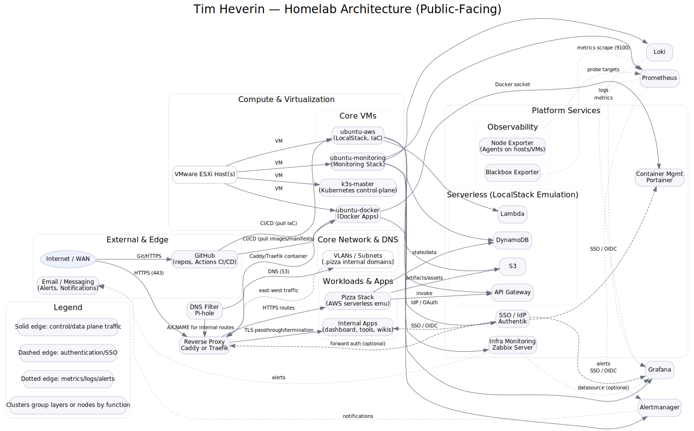

# 🗺️ Homelab Architecture Diagram (Public-Facing)

This repository includes a **Graphviz DOT** diagram describing the high‑level architecture of my homelab (safe for public display — no real IPs or secrets).

## Render Locally

You’ll need [Graphviz](https://graphviz.org/download/). Then run:

```bash
dot -Tsvg homelab_architecture_public.dot -o homelab_architecture_public.svg
```

Commit the generated SVG to your repo and embed it in your README:

```markdown

```

## Customize

- Add/remove VMs, workers, or services by editing `homelab_architecture_public.dot`.
- Keep the **public‑facing** file free of real IPs and secret names.
- Use **dashed edges** for SSO/auth flows and **dotted edges** for metrics/logging paths.
- Use **solid edges** for data/control plane traffic.

> Diagram uses clusters to group **Network**, **Compute**, **Platform Services**, and **Workloads**.
