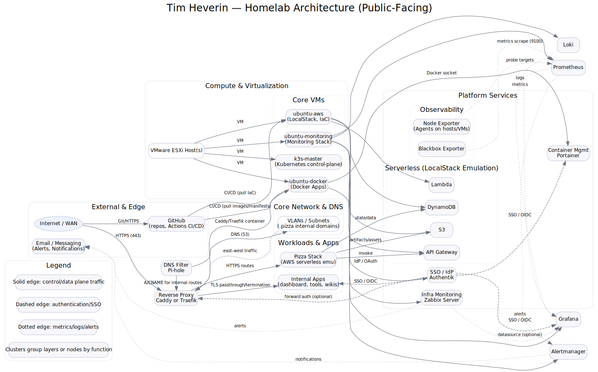

# 👋 Hi, I’m Tim Heverin  

💻 **Senior Systems Engineer | Cloud & Automation | Identity | DevOps**  

I design and support enterprise IT and homelab environments focused on **automation, cloud infrastructure, and identity**.  
My work blends hands-on systems engineering with modern DevOps practices  leveraging **PowerShell, Terraform, and GitOps** to improve efficiency, reliability, and security across hybrid environments.

---

## 🔧 Technical Focus
- **Automation & IaC** → PowerShell, Python, Bash, Terraform, GitOps (ArgoCD)
- **Identity & Access** → Active Directory, Entra ID, Okta, Authentik SSO
- **Cloud & Infrastructure** → Azure, AWS, VMware vSphere (HA/DR), Docker, Kubernetes (K3s)
- **Security & Hardening** → Intune baselines, Conditional Access, Defender for Endpoint, Tenable remediation
- **Monitoring & Observability** → Grafana, Prometheus, Loki, ELK Stack, Blackbox Exporter

---

## 🗺️ Homelab Architecture

  

A high-level overview of my self-hosted **homelab and automation environment**, illustrating how services such as  
**Pi-hole, Caddy, Authentik, Portainer, Grafana, and LocalStack** integrate across multiple VMs and containers.

[homelab_architecture_public.dot](./homelab_architecture_public.dot)

---

## 🧠 Tech Stack

  <!-- Languages -->
  
  
  

  <!-- Cloud / IaC -->
  
  
  
  
  
  

  <!-- OS / Infra -->
  
  
  

  <!-- Monitoring / Misc -->
  
  
  
  

---

## 📌 Featured Projects

- **[PowerShell Playbook](https://github.com/dj-3dub/PowerShell-Playbook)** — Enterprise automation toolkit with PowerShell modules for identity governance, auditing, and system reporting.  
  Focused on improving maintainability, patching workflows, and service reliability across Windows environments.

- **[single-vm-gitops-homelab](https://github.com/dj-3dub/single-vm-gitops-homelab)** — Fully automated GitOps homelab built on Docker, Prometheus, and reverse proxy stacks — all managed through Terraform and CI/CD.

- **[homelab-sso](https://github.com/dj-3dub/homelab-sso)** — Identity & Access sandbox demonstrating Authentik SSO integrations for apps like Portainer and Grafana using OAuth2/OIDC.

- **[monitoring-stack](https://github.com/dj-3dub/monitoring-stack)** — “Observability in a Box” — Grafana + Prometheus + Loki + exporters, with alerting, dashboards, and self-healing watchdog scripts.

- **[CafeOps](https://github.com/dj-3dub/CafeOps)** — A whimsical AWS + LocalStack serverless project combining Terraform, Lambda, and API Gateway — proving even coffee deserves CI/CD ☕.

- **[deepdish-cluster](https://github.com/dj-3dub/deepdish-cluster)** — K3s cluster built via Terraform showcasing hybrid Kubernetes automation and cluster bootstrapping.

---

## 🎯 Current Goals
- Expanding automation blueprints for hybrid infrastructure  
- Enhancing cloud-native designs using AWS & Terraform  
- Studying for the **AWS Certified Solutions Architect – Associate** exam  
- Continuing to evolve the homelab into a full GitOps platform  

---

## 📫 Connect
- 💼 [LinkedIn](https://www.linkedin.com/in/tim-heverin/)  
- 📂 [GitHub Repos](https://github.com/dj-3dub?tab=repositories)  

---

✨ _“A backup isn’t a backup until you’ve restored from it.”_  
❤️ _Made with precision, caffeine, and curiosity._
